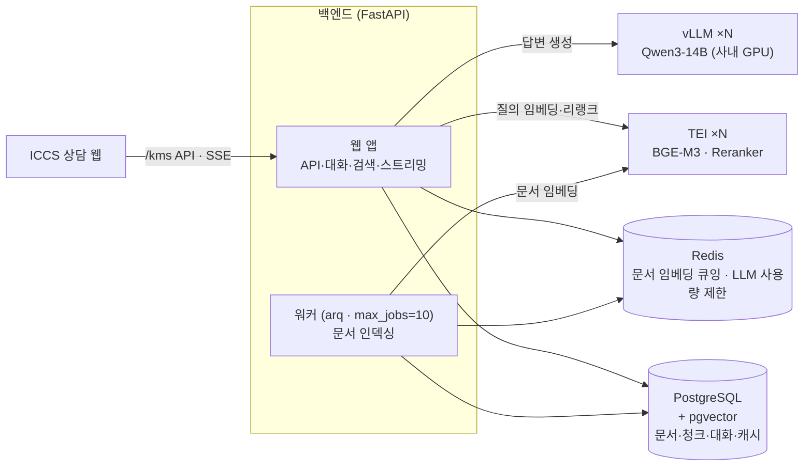
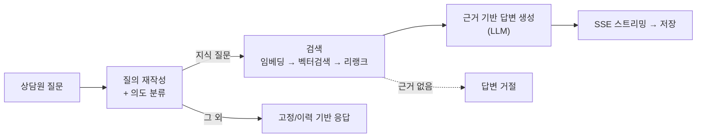

# 상담도우미(KMS) 프로젝트 공유

> 목적: 프로젝트 개요·기능·구성 공유 및 방향 정렬. **기능 골격 구현 단계이며, 세부 완성도·품질은 추가 작업이 필요한 상태.**

---

## 1. 프로젝트 개요

콜센터 **상담원을 위한 지식 검색·답변 도우미** 개발입니다. 상담원이 질문하면,
고객사가 등록한 문서·FAQ를 **근거로** 답변을 찾아줍니다.

- **핵심 원칙**: 근거 없는 답변 금지 — 모든 지식 답변은 검색된 문서에 기반(strict-grounded). 환각 억제.
- **대상 사용자**: 상담원(내부). 최종 고객 대면은 향후 단계.
- **기술 스택**: FastAPI · PostgreSQL(pgvector) · Redis, LLM/임베딩은 사내 GPU 서버(vLLM·TEI) 호출.

---

## 2. 주요 기능

| 기능 | 설명 |
|---|---|
| 지식 Q&A | 문서 근거 기반 답변, 실시간 스트리밍(SSE) |
| 멀티턴 대화 | 후속 질문 맥락 이해(질의 재작성) |
| 의도 라우팅 | 지식 질문 / 그 외(인사·회상 등) 구분 처리 |
| 문서 관리 | PDF·DOCX·XLSX 업로드 → 청킹·임베딩·색인, 버전·폴더·검색 on/off |
| FAQ 관리 | FAQ 등록/검색 편입 |
| 시맨틱 캐시 | 유사 질문 재사용으로 응답 지연·비용 절감 |
| 멀티테넌트 격리 | 고객사(테넌트)별 데이터 분리 |
| 사용량 쿼터 | 테넌트/사용자별 호출·동시성 제한 |
| 운영 지표 | 응답 지연·인용·거절율 등 기록 |

> 세부 완성도(검색 정밀도·답변 품질·예외 처리 등)는 4장 참고.

---

## 3. 시스템 구성도

> 참고: ICCS 적용 시, 웹앱 접근은 gateway를 통한다.

**질의 처리 흐름**

---

## 4. 현재 상태 & 다음 단계

**✅ 완료 — 기능 골격**
- 위 2장 기능들이 하나의 흐름으로 동작. 로컬 및 개발계 서버 기동 확인.

**🔄 진행 중 / 남은 작업 (디테일·품질)**
- **검색·답변 품질 고도화** — 검색 정밀도, 답변 정확성·형식, 경계 케이스 처리
- **컨텍스트 예산·성능 튜닝** — 대화가 길어질 때 안정성
- **운영 대시보드 / UX 디테일**
- **기능 테스트 및 검증**
